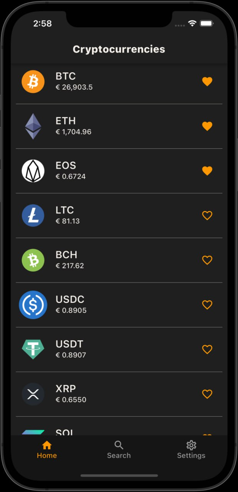
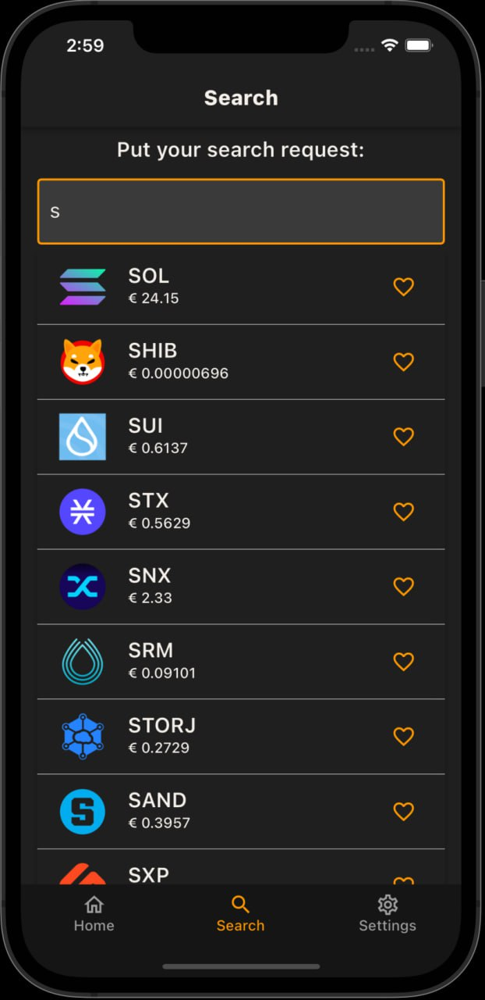
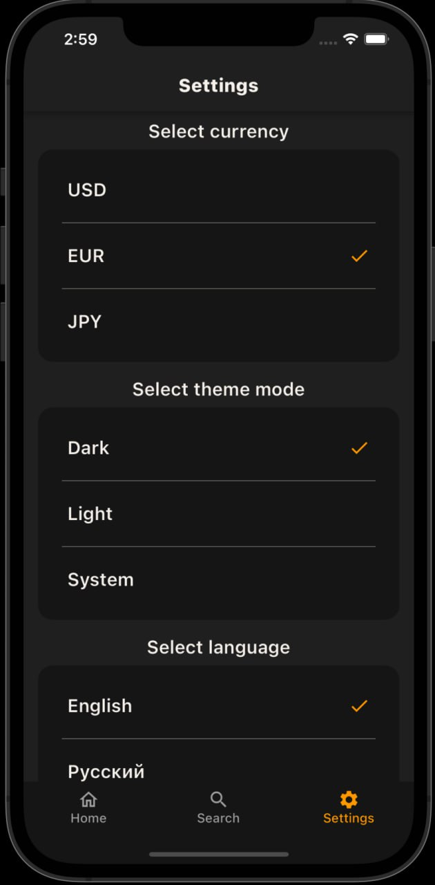
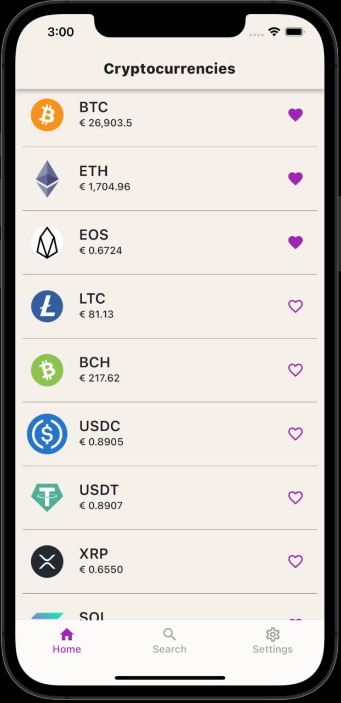
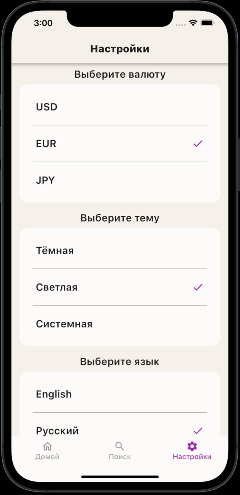

# cryptocurrency_app_flutter
flutter training application

## flutter create app command:
```bash
flutter create --org <org> --project-name <project_name> .
```

<p align="center">
    
    
    
</p>

<p align="center">
    
    
</p>